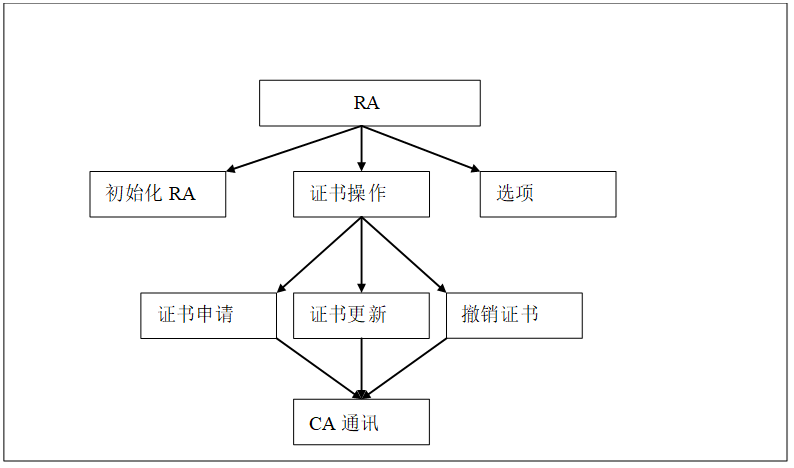
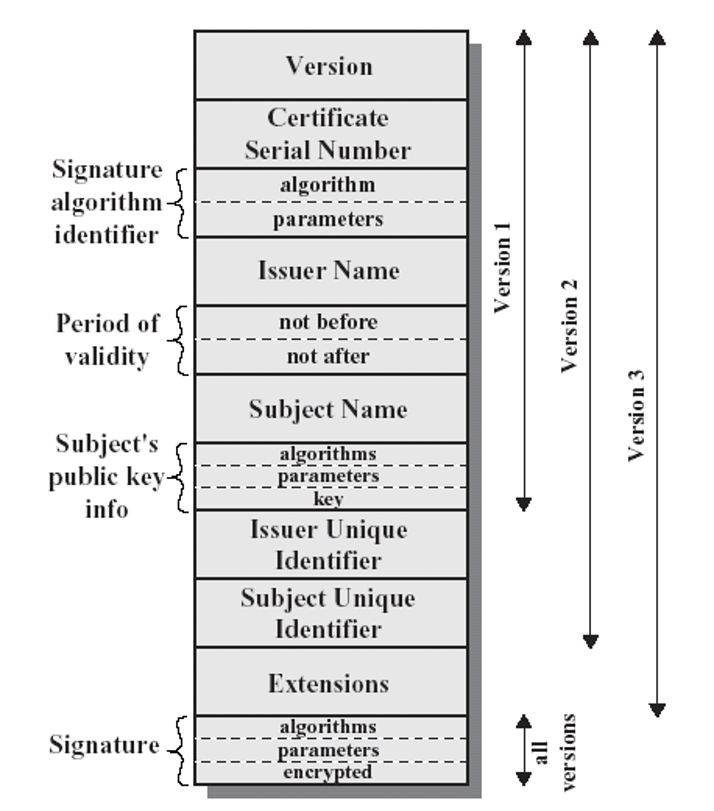
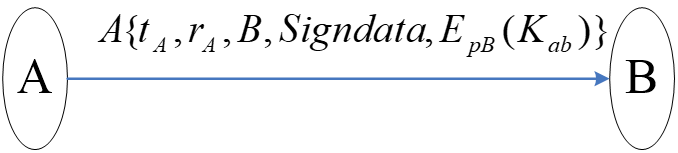
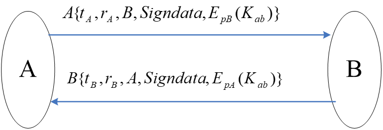
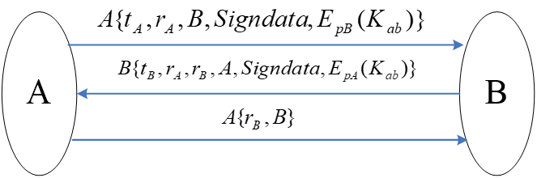
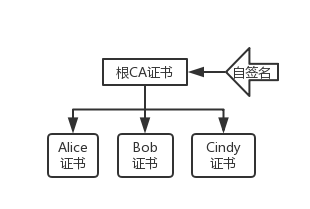
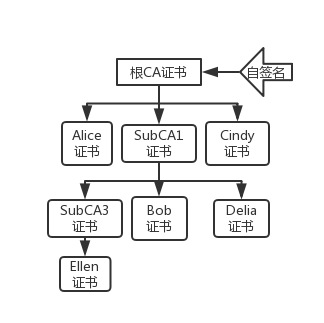
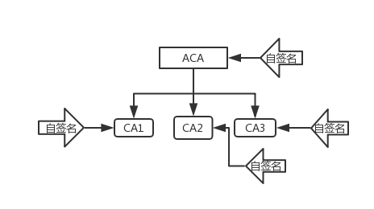

# PKI复习

## 概论

**PKI -- Public Key Infrastructure 公开密钥基础设施**
是用公钥概念与技术来实施和提供安全服务的普遍适用的安全基础设施。

- 完整定义：
    PKI技术是 __公钥技术为基础，以数字证书为媒介，结合对称加密和非对称加密技术，将个人、组织、设备的标识信息与各自的公钥捆绑在一起__ ，其主要目的是通过自动管理密钥和证书，为用户建立一个安全、可信的网络运行环境，使用户可以在多种应用环境下方便地使用加密和数字签名技术，在互联网上验证用户的身份，从而 __保证了互联网上所传输信息的真实性、完整性和不可否认性__ 。PKI是目前为止既能实现用户身份认证，又能保证互联网上所传输数据安全的最有效的技术。

###CA -- Certificate Authority 认证中心
它是一个在互联网络中为网络用户提供安全认证服务的可信赖的第三方机构。其核心功能就是发放和管理数字证书。认证中心保证了数字证书中列出的用户名称与证书中列出的公开密钥的一一对应关系，解决了公钥体系中公钥的合法性问题。认证中心对数字证书的数字签名操作使得攻击者不能伪造和篡改数字证书，用户也是通过验证CA的签名来检查证书的合法性。

CA的主要功能为：
- 接收验证用户数字证书申请
- 确定是否接受用户数字证书的申请――证书的审批
- 向申请者颁发、拒绝颁发数字证书――证书的发放
- 接受、处理用户数字证书的更新请求――证书更新
- 接受、处理用户数字证书的查询、撤销请求
- 产生和发布证书注销列表（CRL）
- 数字证书的归档
- 历史数据归档

###RA -- 注册机构
RA是注册机关，位于CA与用户之间，用来汇总整理用户的证书申请等各种信息，并协助CA完成证书管理功能。

RA需要完成的主要功能有：
- 数字证书申请的鉴定与注册；
- 提供有限的用户支持；
- 维护RA相关的文档备份；
- 为PKI的审计工作提供协助。

RA主要完成以下主要的功能：加载RA证书、收集申请者信息、构建RSA个人证书请求、证书的更新、证书的撤销等 。

###网络安全面临的主要安全威胁：
- 假冒：指非法用户假冒合法用户身份获取敏感信息
- 截取：指非法用户截获通信网络的数据
- 篡改：指非法用户改动所截获的信息和数据
- 否认：通信的单方或多方事后否认曾经参与某次活动

PKI能够提供的安全保障：
- 能够验证用户身份合法性
- 能保障数据的保密性和完整性
- 能够采用数字签名技术满足不可否认性

PKI技术能够为用户建立一个安全、可信的网络运行环境，使用户可以在多种应用环境下方便地使用加密和数字签名技术，在互联网上验证用户的身份，从而保证了互联网上所传输信息的真实性、完整性和不可否认性。PKI是目前为止既能实现用户身份认证，又能保证互联网上所传输数据安全的最有效的技术。

## 数字证书
数字证书由权威的第三方机构认证中心(CA)签发，用以绑定证书持有人公钥及其身份信息的电子文档。数字证书是PKI中最重要的、最基本的数据要素。
数字证书PKI信任机制的基础，也是PKI提供诸如身份认证、完整性、机密性和不可否认性（网络安全四大要素）等安全服务的基石。
目前通用的数字证书格式是X.509证书

### X.509 证书格式

#### 扩展项(Extentions)
**为什么需要扩展项?**
1) 对密钥拥有者的身份来讲，主体Subject字段是不充分的。X.509的名称可能相对较短，缺少用户需要的明显的身份细节。
2) 缺乏与安全策略的关联信息。实践中，为支持不同安全需求，CA会制定不同安全策略以及相应的数字证书，而不同安全策略对应的安全强度不同。
3) 缺乏证书适用性及约束条件的说明。但证书的使用有时是有条件的，如交叉认证中可能只允许部分用户能够相互认证。
4) 不能识别同一用户的不同密钥的识别，但实际应用中，同一用户可能有用于不同用途的密钥对，如用于签名的、用于加密的等等；另外，在密钥生命周期中，不同时间使用的不同密钥。

###怎样验证数字证书的真假
数字证书有明文 P 和签名信息 S 两部分组成，P 中有公钥 PK 、签发者 ID 等信息；CA 保管着私钥 SK, 加密算法一般是RSA，
H = Hash(P), S = RSA加密 (H, SK) ，
某人在得到数字证书 (P, S) 后，使用相同的 hash 算法，得到 H1 = Hash ( P ) ，
用 P 中的公钥 PK 解密 S ，得到 H2 = RSA解密 (S, PK) ，
if H1 = H2 ,则该证书是签发者签发给 Subject 的证书
否则， 内容 P 可能被篡改过或者证书不是由 CA 签发

##X509认证方式
###单向认证方式

A{...} 表示 A 对 {...}的签名
$r_A$ 是随机数 ，用以抵抗重放攻击；  $t_A$ 为时间戳，可以表示为两个时间，一个是数据的产生时间，一个为数据的超时时间。B 为用户  的身份信息，用以标识接收方
若需要签名证明某数据 *SignData* 的来源时，可将数据加入签名中
若需要传送机密信息，如协商密钥，则加上用 B 的公钥加密的机密信息$E_{pB} ( K_{ab} )$

验证过程:
    1. B 收到消息，首先获取 A 的证书并验证其有效性，然后从中取得 A 的公钥
    2. 校验签名和签名信息的完整性；
    3. 检查该消息是否是发给自己的；
    4. 检查时间戳，是否在有效期之内；
    5. 检查 $r_A$ 是否被重复出现过。

###双向认证方式

功能：
    1、接收方B可以验证发送方A的身份以及数据的完整性、新鲜性
    2、通过接收方的回复，发送方A还可以确认接收方是B（由B得签名确认），且由B发送的数据的完整性验证可知接收方B已完全获得A所发送的数据（数据、共享的机密信息）。

###三向认证方式

1. A向B发送 $A \{ t_A, r_A, B, SignData, E_{pB} ( K_{ab} ) \}$
2. B收到消息，首先获取A的证书并验证其有效性，然后从中取得A的公钥，然后
    校验签名和签名信息的完整性；
    检查该消息是否是发给自己的；
    检查时间戳，是否在有效期之内；
    检查rA是否被重复出现过。
3. B向A发送 $B \{ t_B, r_A, r_B, A, SignData, E_{pA} ( K_{ab} ) \}$
4. A收到后，首先验证签名，然后
    检查是否是发给自己的信息；
    检查 B 的时间戳；
    检查 $r_A$ 是否是刚才发出的，若是，表明 B 收到的不是一个消息重放，否则是重放。
    检查 $r_B$ 是否回复过，若没有，则回复
5. B 收到回复后，验证 A 的签名，并检查 $r_B$ 是否是最近发出的，若是，说明 A 收到的不是消息重放，否则是重放。

注：此流程中验证时间戳是可选的

在前面的两种认证过程中，发送方与接收方必须有一个同步时钟才可以顺利执行，但由于网络延迟及计算机系统时间的误差，要求双方的时间同步，在技术上难以达到。
通过接收方增加一次回传收到的随机数，通过检查随机数来识别是否是消息重放，并不需要检查时间标记。
虽然多了一次数据的传送，但在技术上更容易实现。其可以达到前面双向识别的功能，但并不需要检查时间标记，只需要检查不重复的随机数是否正确。

## 以RSA算法为例，以检查用户是否拥有私钥为目的，说明什么是挑战-响应模式
> RSA 密码体制：
> 设 $p$ , $q$ 是两个不同的奇素数. $n = p * q$ 
> 明文集 $P$ = 密文集 $C = Z_n$
> $K = \{(n, p, q, d, e): e*d \equiv 1 \mod \phi(n) \}$ 
> $e_K (x) = x^e \mod n $.   $d_K (y)= y^d \mod n .   (x, y \in Z_n )$
> Public Key: (n, e ). Private Key: (p, q, d )
1. 问题描述
Alice 拥有私钥(p, q, d)，
Bob拥有Alice的公钥(n, e)，
Bob不确定Alice是否真的拥有私钥，
Bob向Alice发起挑战随机数挑战。

2. 挑战-响应 模式详解
（1）Bob生成一个随机数r，并用Alice的公钥加密 $c= r^e \mod n$ ，然后Bob把c发给Alice，要求Alice解密c。 
（2）Alice收到Bob发过来的c以后，用自己的私钥解密 $m = c^d \mod n$ 。然后把m发送给Alice。
（3）Bob收到Alice发过来的m后，检验 r=m 是否成立，成立则信任Alice。

3. 挑战-相应模式的安全性分析
Alice 只有真的拥有私钥(p, q, d)，才能在第 2.（2）步通过 $m = c^d \mod n$ 解密c。如果Alice没有私钥是无法解密c的。

## PKI 信任模型
- 信任锚(Trust Anchor)：在信任传递（也就是建立证书路径）的过程中，需要有信任的起点，称为信任锚。根CA在证书验证过程中，就是Trust Anchor
- 信任路径：由信任锚到达待确认实体的各个证书组成的路径称为信任路径。
- 信任模型：对于PKI系统中的用户，应该具有什么样的信任锚、以及在信任传递过程中的各种措施

###单根CA

####基本模型Base Model（单级CA模型）
系统中只有 1 个 根CA，也就是只有 1 个信任锚
- 只有信任锚有自签名证书
- 只有信任锚能签发用户证书
- 没有信任传递

特点：
- 验证证书简单
    容易实现，易于管理，只需建立一个根CA
    直接使用信任锚就可以验证
    不存在信任传递，太多的信任传递将变得不可信
- 缺少扩展能力
    无法分开管理，不同的证书由不同的单位负责签发
    信任锚必须经常运行。密钥频繁使用，安全威胁较大，可信程度就降低
- 当CA出问题就是信任锚出问题

####严格层次模型 Strict Hierarchy
特点:
- 只有信任锚有自签名证书
- 信任锚之外的CA没有自签名证书，由其上级CA向其签发证书
- 每个CA最多只有1个上级CA

优点:
- 用户容易增加新的认证域
- 证书路径由于其单向性，容易扩展
- 证书路径相对较短
- 证书短小、简单

缺点:
- 单个CA的失败会影响整个PKI体系
- 建造一个统一的根CA是不现实的。

###多根CA
因为现实的原因单根 CA 的环境是不可能的，除非是很小范围的用户、封闭的单位。
现实中，已有了很多的根CA，各国都有。所以，我们必须考虑多根CA的情况。

####证书信任列表 Certificate Trust List（WEB模型）
把所有信任的根CA证书组成信任列表。类似于我们现在的IE浏览器，我们可以自主地再安装新的根CA证书，把它置于受信任的根证书颁发机构：有用户自己处理 或 权威发布两种方式
- CTL方式（用户自主处理）：
    - 由用户自己确定是否信任对应的根CA
    - 用户可以自主地删除或者添加信任锚
- CTL方式（权威发布方式）：
    - 由根CA统一地发布1个可信的信任锚列表Certificate Trust List
    - 可能是以各种方式发布，如网页文字说明（eg.工信部），数字签名的文件（eg.桥CA）

特点:
- 验证简单
    - 与单根CA情况一致
    - 证书认证路径构造简单(因为安装了CTL文件，验证系统有多个信任锚，可以直接验证其他域的证书)
- CTL由某个CA发布
    - 该CA负责对其他根CA的考察、安全地得到其证书
    - 一次性的信任传递（不通过证书传递，通过CTL文件传递）
    - 信任对本域根CA，导致对其他域根CA的信任，成为信任锚
    - 传递是一次性的，以后不需要了
    - 验证者应用程序同时识别多套CP
      无策略映射

####鉴定证书 Accreditation Certificate（用户为中心模型）
CTL的另一种方式,Accreditation CA（简称ACA）
由受信任CA直接给已有的根CA再签发一次证书，从而说明该根CA是可信的
ACA有自签名证书，给其他根CA签发Accreditation Certificate
其他根CA也有自签名证书

- 信任锚变化：
除了已有的信任锚,还要加入ACA
ACA也可签发CRL（被引入的信任锚是动态变化的）
ACA的作用仅仅用来传递信任锚，说明哪些根CA是可以信任的(也是一种传递CTL的方式)

Accreditation Certificate方式看起来与严格层次模型类似，不同点在于：
- 首先，每个Accredited的CA都具有各自的CP（证书策略：规定了证书的安全需求和适用范围）；
- 其次，每个Accredited CA都具备自签发证书，都是自治的。

####交叉认证 Cross Certification（分布式CA模型）
本域的CA给其他域的CA签发证书，使得信任传递的范围扩大

- 优点：
    1.  由CA统一完成,不需要每个用户独立地配置
    2.  信任扩大是可控的,通过使用各种证书扩展
    3.  是一种可控制的方式，因为可加入各种扩展限制，包括路径限制、命名限制、策略限制
    4.  没有改变信任锚（非常重要的优点），可以随时撤销

- 缺点：
    因为多个CA之间，认证路径自动构造，可能进入死循环，也可能会找到多条路径，策略映射的结果完全不一样。 

####网状Mesh （分布式CA模型）
网状模型并不是一种专门的模型
- 多次交叉认证，就形成网状(可能是单向或双向）
- 相当于是N个CA之间，进行了交叉认证

因为多个CA之间，都要各自为政地相互进行交叉认证，所以，就会出现了上面的问题：
- 次数多
- 多条证书认证路径

解决方法：
进行分工，由单独的机构解决CA互联的问题。然后，所有CA统一地与该机构进行交叉认证

####桥CA —— Bridge CA
桥CA能够克服网状的问题，但
- 增加了投资，多了单独的桥CA
- 证书认证路径多了1步
- 对于信任范围的扩大，各个根CA难以自主地进行控制，而在网状情况下，根CA能够自主地决定想要与哪个CA交叉认证

## 重放攻击
- 重放攻击(Replay Attacks)又称重播攻击、回放攻击，是指攻击者发送一个目的主机已接收过的包，来达到欺骗系统的目的，主要用于身份认证过程，破坏认证的正确性。重放攻击可以由发起者，也可以由拦截并重发该数据的敌方进行。攻击者利用网络监听或者其他方式盗取认证凭据，之后再把它重新发给认证服务器。

###原理：
重放攻击的基本原理就是把以前窃听到的数据原封不动地重新发送给接收方。很多时候，网络上传输的数据是加密过的，此时窃听者无法得到数据的准确意义。但如果他知道这些数据的作用，就可以在不知道数据内容的情况下通过再次发送这些数据达到愚弄接收端的目的。
例如，有的系统会将鉴别信息进行简单加密后进行传输，这时攻击者虽然无法窃听密码，但他们却可以首先截取加密后的口令然后将其重放，从而利用这种方式进行有效的攻击。再比如，假设网上存款系统中，一条消息表示用户支取了一笔存款，攻击者完全可以多次发送这条消息而偷窃存款。

###防范：
####第一种方法：利用随机数防止重放攻击
1、服务器首先生成一随机数，送往客户端
2、客户端对用户ID、密码与随机数进行散列，然后把散列值发往服务器方。
3、服务器利用用户ID、密码与原先产生的随机数散列，然后与用户传过来的散列值比较来判定是否通过验证。
注：由于攻击者不知ID及密码，不能构造相应的散列值，随机数又能保证每次会话的新鲜性。

####第二种方法：利用时间数据来防止重放攻击
1、在客户端生成一个时间标记，直接与客户的ID与密码散列后传送到服务器端，省去了服务器到客户的随机数回送。
2、验证时服务器除验证ID与密码散列是否一致外，还需验证时间是否一致，若时间不一致，则认证不通过。
3、需解决时钟同步问题，解决方法是在验证服务器上进行多次试探验证，在一个时间范围内试探，如果成功则在服务器上存储时钟的偏移量，以便下次登录时验证。

问题：由于口令较短，散列运算速度快，有穷举攻击获取用户ID及口令（或者他们的散列值）的可能

## LDAP（Lightweight Directory Access Protocol) 轻量级目录访问协议
LDAP是一个目录服务协议，是X.500的简化版，并且支持TCP/IP协议。
###特点： 
- 层次结构清晰，存取速度快；
- 同步复制和分布式服务功能；
- 可以跨越平台和系统；
- 完善的安全控制措施。
- 高度的开放性
###四类共10种操作：
- 查询类操作：查找和比较
- 更新操作：新增、删除、修改、修改RDN
- 认证操作：绑定、解绑定
- 其他操作：放弃、扩展

除了扩展操作，别的都是LDAP的标准操作；扩展操作是LDAP中为了增加新的功能，提供的一种标准的扩展框架,不同的LDAP厂商也均定义了自己的扩展操作

##WPKI--无线PKI

**WAP**：Wireless Application Protocol. 实现移动终端上网的一组无线应用协议
通过WAP，用户可以随时随地利用无线通讯终端来获取互联网上的即时信息或公司网站的资料，真正实现无线上网。它是移动通信与互联网结合的第一阶段性产物。

### WPKI与PKI的主要区别
1）所使用的算法要求不同：无线PKI选用功耗低的轻量级算法
2）证书格式的差异，无线证书要求更小 
3）证书生命周期不同，无线PKI证书生命周期短
4）证书吊销的处理方式不同 

**WTLS(Wireless Transport Layer Security)** 协议所处位置在WDP层与WTP层之间，其功能等价于TCP/IP协议栈中的TLS-SSL层，是为实现传输数据的安全服务的。
WTLS向上传递服务，WTLS向下发送内容。

### WTLS 3个安全级别:
- 级别1：在无线设备和WAP网关间提供保密和完整性；
- 级别2：增加了网关到安全服务间的认证；
- 级别3：增加了无线客户的认证。

Request For Comments（RFC），是一系列以编号排定的文件。文件收集了有关互联网相关信息，以及UNIX和互联网社区的软件文件。目前RFC文件是由Internet Society（ISOC）赞助发行。基本的互联网通信协议都有在RFC文件内详细说明。几乎所有的互联网标准都有收录在RFC文件之中

*Copyright 2018/6/20 by YJJ*

